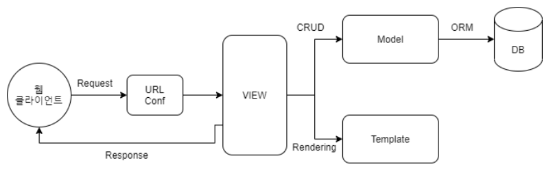

# MTV(Model-Template-View)

장고는 MVC를 기반으로 한 프레임워크이며 MVC에서 다룬 각 요소의 독립적인 설계 방식은 비슷하나 그렇다고 동일한 패턴은 아니다.





## **Model**
- 데이터베이서에 저장되는 데이터를 의미. 

- 참고로 DB다룰 때 SQL몰라도 장고에서 제공하는 ORM을 사용할 수 있음.

- 데이터 처리 및 유효성 검사와 관련된 항목이 포함된다. 하단 코드 참고

```
class Question(models.Model):
    question_text=models.CharField(max_length=200)

    pub_date=models.DateTimeField('date published')

    def __str__(self):
        return self.question_text

    def was_published_recently(self): //데이터 처리 및 유효성 검사
        return self.pub_date >= timezone.now() - datetime.timedelta(days=1)
```


- Django의 Migration 사용시 각 Model들은 Model들의 이름이 테이블 명, Model들의 지역 변수들이 컬럼명이 되는 테이블 생성가능

```
python manage.py makemigrations
```
-> 현재 Model들을 대상으로 테이블을 생성할 것이 있는지, 변경사항이 있는지 체크하고 파일을 하나 만들어줌

```
python manage.py migrate
```
-> DB에 테이블이 생성 및 변경됨


## **Template**

- MVC의 View에 해당

- View에서 받은 데이터를 Template에 동적으로 적용한다.

- 유저에게 보여지는 화면인 html 파일


## **View**

- MVC의 Controller에 해당

- 웹의 요청을 받으면 전달받은 데이터들을 해당하는 어플리케이션의 로직으로 가공하여, 결과를 Template에 전송한다.

- HTTPRequest를 받아 HTTPResponse를 리턴하는 형태

- 비즈니스 로직(유저의 눈에는 안보이지만, 결과물 도출을 위해 짜여진 코드 로직)의 핵심


```
class DetailView(generic.DetailView):
    model = Question
    template_name = 'polls/detail.html'

```


## **URLconf**

- URL는 View와 Template을 이어주고, 이 부분을 만드는 작업은 URLconf라고 한다.

- 가공한 데이터를 유저가 보는 화면으로 넘겨주고 싶을 때 사용한다.

- path(), include()

```
urlpatterns = [
    path('admin/', admin.site.urls),
    path('', include(router.urls)),
    path('api-auth/', include('rest_framework.urls', namespace='rest_framework'))
]
```
