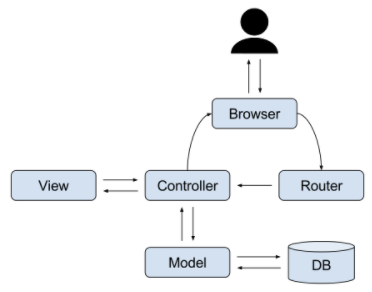

# MVC(Model-View-Controller)

Model, View, Controller의 각 요소들이 서로 영향을 미치지 않게 하는 패턴.

서로 분리되어 각자의 역할에 집중할 수 있게끔 하여 애플리케이션의 유지보수성/확장성/유연성 을 증가시킨다.

## **Model**
- Model 상태 변화 시 View와 Controller에 통보

- 여러개의 View를 가질 수 있다

- 순수하게 public 함수로만 이루어짐

- 데이터베이스와 관련된 로직

#### **주의사항**
1. 사용자가 편집하려는 모든 데이터를 갖고 있어야함.

2. View나 Controller에 대한 어떤 정보도 알지 말아야 한다.

3. 변경이 일어날 때를 대비한 변경 통지 처리방법의 구현이 필요하다.

## **View**
- 사용자가 볼 결과물을 생성하기 위해 Model로부터 질의를 하고 값을 가져옴

- ui와 같이 데이터를 시각적으로 보이게 표현하는 것

- jsp

#### **주의사항**
1. Model의 정보를 따로 저장하면 안된다.

2. Model, Controlloer에 대한 어떤 정보도 알지 말아야 한다.

3. 변경이 일어날 때를 대비한 변경 통지 처리방법의 구현이 필요하다.

## **Controller**
- Model에 명령을 보냄으로써 모델 상태 변경

- 어플리케이션 전반적인 흐름, 영향을 미치는 요소

- servlet

#### **주의사항**

1. Model이나 View에 대해 알고 있어야 한다.

2. Model이나 View의 변경을 모니터링 해야한다.

## **순서**
1. View에서 이벤트 수행

2. Controller에서 수행할 메소드를 Model에 전송

3. Model에서 메소드를 수행하고 결과값을 Controller에 반환

4. Controller에서 반환받은 내용을 View로 반환

5. View에서 이벤트 결과 확인 (ex. jsp)

