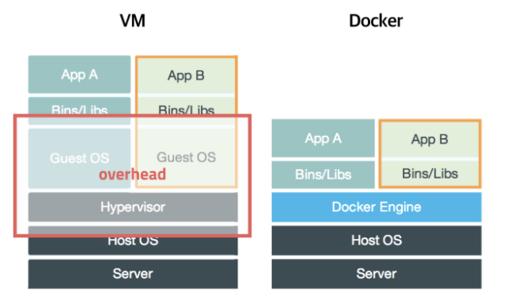

# docker

- 애플리케이션을 빠르게 구축하고 테스트, 배포까지 할 수 있는 플랫폼

- 개발자가 배포한 프로그램을 받아 실행할 때 환경의 문제가 없도록 실행환경을 컨테이너로 추상화 -> 프로그램의 배포/관리 단순화

- 프로세스를 격리하는 방식으로, CPU나 메모리는 프로세스가 필요한 만큼만 추가로 사용하고 성능 손실도 적다. 낮은 overhead. (기존 가상머신은 호스트 OS위에서 가상머신설치+Guest OS를 설치하여 무거움)



## **Image**
- 서비스 운영에 필요한 서버, 소스, 라이브러리, 컴파일 된 실행 파일을 하나로 묶는 형태. 읽기 전용 템플릿이다. 

- 프로세스 실행을 위한 모든 파일과 환경을 지님.

- Immutable

- Docker hub에 등록하거나 Docker Registry를 직접 만들어 관리할 수 있음


## **Container**
- Image를 실행한 상태

- 응용 프로그램 자체를 패키징/캡슐화하여 격리된 공간에서 프로세스를 동작시키는 기술

- OS레벨 공유, 어플리케이션 레벨에서는 각각의 어플리케이션 격리하여 독립적으로 실행


- 종료되어도 메모리에 남아있음. 삭제하고 싶으면 명시적으로 삭제하기

## **Dockerfile**
```
# syntax=docker/dockerfile:1
# 1. 파이썬 설치
FROM python:3 
# 2. 환경변수 설정
ENV PYTHONUNBUFFERED=1
# 3. 명령어를 실행할 디렉토리 (배시 셸의 cd와 같음)
WORKDIR /code
# 4. 로컬의 파일을 이미지에 추가
COPY requirements.txt /code/
# 5. 컨테이너 내부에서 명령어 실행 -> 이미지 만듬
RUN pip install -r requirements.txt
COPY . /code/
```
- 컨테이너에 설치해야하는 패키지, 명령어, 환경변수 등을 기록한 하나의 파일.
- Dockerfile을 빌드하면 자동으로 이미지가 생성된다.
- 이미지 생성 후 애플리케이션 빌드 및 배포를 자동화할 수 있음.


## **Docker-compose.yml**
```
version: "3.9"
   
services:
  db:
    image: postgres
    volumes:
      - ./data/db:/var/lib/postgresql/data
    environment:
      - POSTGRES_DB=postgres
      - POSTGRES_USER=postgres
      - POSTGRES_PASSWORD=postgres
  web:
    build: .
    command: python manage.py runserver 0.0.0.0:8000
    volumes:
      - .:/code
    ports:
      - "8000:8000"
    depends_on:
      - db
```
- 각각의 네트워크가 분리된 상태에서는 백엔드와 데이터베이스가 데이터를 주고받지 못하는 등 문제가 생김. 이때 이 요소들을 연결에서 서비스를 설계하기 위해 이를 사용.

- 이 파일이 없으면 run명령어를 따로 실행해야되고, 또 그 때마다 services : 안에 있는 각각의 명령들을 직접 입력해야함.